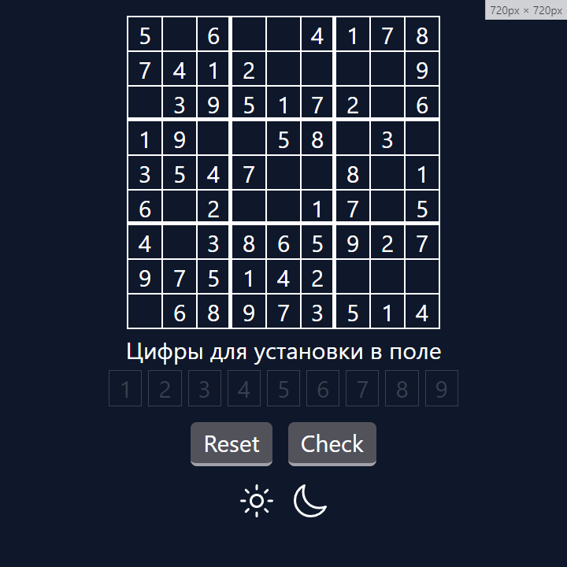

# Sudocu Project

This is a sudoku game

## Screenshots



## Installation

First you need to install all the dependencies to run this project. But first make sure you have Node js installed.
To do this, open a command prompt or terminal and type the following commands:

```bash
node -v
```

```bash
npm -v
```

If you are using the pnpm package manager, then run this command:

```bash
pnpm -v
```

After that, go to the folder with this project and run the following command:

```bash
npm install
```
Or
```bash
npm i
```

If you are using the pnpm package manager, then run this command:

```bash
pnpm install
```
Or
```bash
pnpm i
```

## Usage

After installing the dependencies, use the following command to run, depending on the package manager you are using:

```bash
npm run start
```
Or
```bash
pnpm start
```

After launching, copy and paste the following url into the address bar:

[http://localhost:5000](http://localhost:5000)

## Authors

- [Dmitriy303](https://github.com/rusnakdima)

## License

This project is licensed under the [License Name](LICENSE.MD).

## Contact

If you have any questions or comments about this project, please feel free to contact us at [contact email](rusnakdima03@gmail.com).